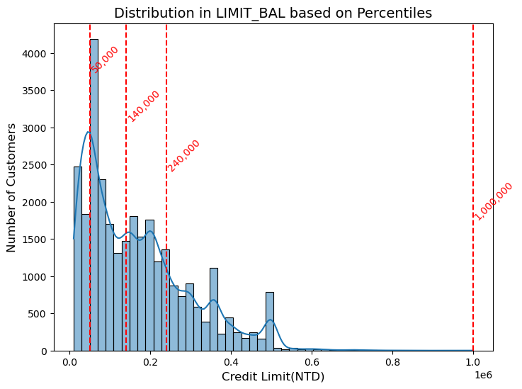

# AI-Driven Credit Risk & Fraud Analytics

## Overview
The **AI-Driven Credit Risk & Fraud Analytics** project leverages machine learning and AI to assess financial risk and detect fraudulent activities in customer transactions. This project aims to automate risk assessment using AI-powered scoring models while identifying anomalies that indicate potential fraud. The insights generated help financial institutions mitigate risk and enhance fraud detection efficiency.

## Project Flow

1. **Data Collection & Setup**

2. **AI-Powered Risk Scoring (ML Component)**  

3. **Fraud Detection (Anomaly Detection & NLP)**  

4. **Tableau Dashboard (AI-Driven Insights Visualization)**  

5. **Final Touches & Resume Optimization**  

## Tools & Technologies Used

### **Data Storage & Processing:**
- PostgreSQL (Database for structured data analysis)
- Pandas & NumPy (Data manipulation & preprocessing)

### **Machine Learning & AI:**
- Scikit-learn (Supervised & Unsupervised ML models)
- XGBoost & Random Forest (Risk Scoring Model)
- Isolation Forest (Anomaly Detection for Fraud)
- NLP (Text analysis for fraud-related complaints)

### **Visualization & Reporting:**
- Tableau (Interactive dashboards for financial insights)
- Matplotlib & Seaborn (EDA & statistical visualizations)

### **Project Development & Deployment:**
- Python (Core language for data processing & ML)
- Jupyter Notebooks (Experimentation & model building)
- Git (Version control for project tracking)

## Step 1: Data Collection & Setup
### Data Analysis
- The dataset contains financial transactions and customer credit data, including bill amounts, payment history, credit limits, and default status
- Data cleaning was performed:
    - Removed duplicate and missing values
    - Handled outliers using IQR-based capping, applied separately for each credit limit category to maintain fairness
- Data was loaded into PostgreSQL for structured storage and analysis

### Data Visualization
Default Rate Analysis by Credit Limit:
```postgreSQL
import seaborn as sns
import matplotlib.pyplot as plt

plt.figure(figsize=(8,6))
sns.histplot(x = df_copy['LIMIT_BAL'], bins = 50, kde = True)

x = df_copy['LIMIT_BAL'].quantile([0.25, 0.50, 0.75, 1.0])
y_positions = [0.85, 0.70, 0.55, 0.40]
```

Unusual Repayment Behavior Trends:
```sql
query = """
    SELECT
        credit_limit_category,
        payment_behavior,
        COUNT(*) AS total_customers,
        SUM(CASE WHEN default_payment_next_month = 1 THEN 1 ELSE 0 END) AS defaulters,
        ROUND(100.0 * SUM(CASE WHEN default_payment_next_month = 1 THEN 1 ELSE 0 END) / COUNT(*), 2) AS default_rate
"""
unusual_repayment_credit = pd.read_sql(query, engine)
unusual_repayment_credit
```

### Results

 
*Default Rate Analysis by Credit Limit*

### Unusual Repayment Behavior Trends
| credit_limit_category | payment_behavior | default_rate |
|----------------------|-------------------|--------------|
| Medium Credit Limit  | Unusual Behavior  | 32.64        |
| Low Credit Limit     | Highly Unusual    | 32.60        |
| Very High Credit     | Normal Behavior   | 8.95         |

### Results
- Customers with low credit limits are at the highest risk of default
- Those with unusual repayment behavior (paying tiny amounts or almost nothing) have a significantly higher default rate
- The default rate is lower for customers with higher credit limits, but unusual repayment patterns still indicate risk

### Insights
- **Fraud Detection**: Customers who repeatedly make **extremely small payments** or have **zero repayments** on high bill amounts need further investigation
- **Credit Risk Management**:
    - **Credit limit upgrades** should be carefully evaluated, especially for those in **low and medium credit limit groups** showing repayment issues
    - Customers with **Highly Unusual Behavior** should receive **early intervention strategies**, such as reminders, due date extensions, or stricter approval criteria