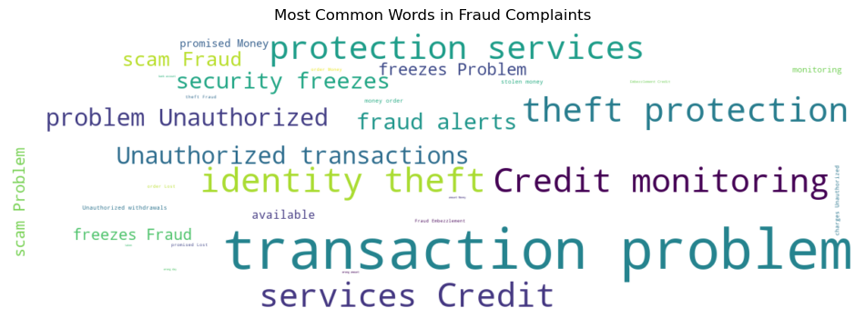
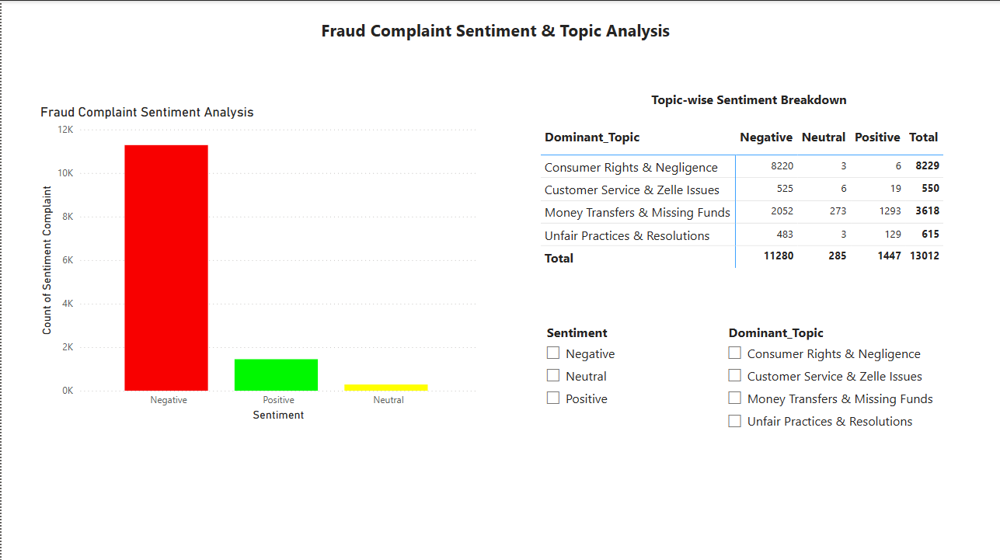

# AI-Driven Credit Risk & Fraud Analytics

## Overview
The **AI-Driven Credit Risk & Fraud Analytics** project leverages machine learning and AI to assess financial risk and detect fraudulent activities in customer transactions. This project aims to automate risk assessment using AI-powered scoring models while identifying anomalies that indicate potential fraud. The insights generated help financial institutions mitigate risk and enhance fraud detection efficiency.

## Project Flow

1. **Data Collection & Setup**

2. **Feature Engineering & Preprocessing for ML**  

3. **AI-Powered Credit Risk Prediction**  

4. **AI-Driven Fraud Detection**  

5. **Interactive Power BI Dashboard**  

## Tools & Technologies Used

### **Data Storage & Processing:**
- PostgreSQL (Database for structured data analysis)
- Pandas & NumPy (Data manipulation & preprocessing)

### **Machine Learning & AI:**
- Scikit-learn (Supervised & Unsupervised ML models)
- XGBoost & Random Forest (Risk Scoring Model)
- Isolation Forest (Anomaly Detection for Fraud)
- NLP (Text analysis for fraud-related complaints)

### **Visualization & Reporting:**
- Tableau (Interactive dashboards for financial insights)
- Matplotlib & Seaborn (EDA & statistical visualizations)

### **Project Development & Deployment:**
- Python (Core language for data processing & ML)
- Jupyter Notebooks (Experimentation & model building)
- Git (Version control for project tracking)

## Step 1: Data Collection & Setup
### Data Analysis
- The dataset contains financial transactions and customer credit data, including bill amounts, payment history, credit limits, and default status
- Data cleaning was performed:
    - Removed duplicate and missing values
    - Handled outliers using IQR-based capping, applied separately for each credit limit category to maintain fairness
- Data was loaded into PostgreSQL for structured storage and analysis

Detailed model training scripts can be found in [`03_data_exploration.ipynb`](notebooks/03_data_exploration.ipynb)

---
### Data Visualization
Default Rate Analysis by Credit Limit:
```postgreSQL
import seaborn as sns
import matplotlib.pyplot as plt

plt.figure(figsize=(8,6))
sns.histplot(x = df_copy['LIMIT_BAL'], bins = 50, kde = True)

x = df_copy['LIMIT_BAL'].quantile([0.25, 0.50, 0.75, 1.0])
y_positions = [0.85, 0.70, 0.55, 0.40]
```

Unusual Repayment Behavior Trends:
```sql
query = """
    SELECT
        credit_limit_category,
        payment_behavior,
        COUNT(*) AS total_customers,
        SUM(CASE WHEN default_payment_next_month = 1 THEN 1 ELSE 0 END) AS defaulters,
        ROUND(100.0 * SUM(CASE WHEN default_payment_next_month = 1 THEN 1 ELSE 0 END) / COUNT(*), 2) AS default_rate
"""
unusual_repayment_credit = pd.read_sql(query, engine)
unusual_repayment_credit
```
---
### Results

 
*Default Rate Analysis by Credit Limit*

### Unusual Repayment Behavior Trends
| credit_limit_category | payment_behavior | default_rate |
|----------------------|-------------------|--------------|
| Medium Credit Limit  | Unusual Behavior  | 32.64        |
| Low Credit Limit     | Highly Unusual    | 32.60        |
| Very High Credit     | Normal Behavior   | 8.95         |

### Results
- Customers with low credit limits are at the highest risk of default
- Those with unusual repayment behavior (paying tiny amounts or almost nothing) have a significantly higher default rate
- The default rate is lower for customers with higher credit limits, but unusual repayment patterns still indicate risk
---
### Insights
- **Fraud Detection**: Customers who repeatedly make **extremely small payments** or have **zero repayments** on high bill amounts need further investigation
- **Credit Risk Management**:
    - **Credit limit upgrades** should be carefully evaluated, especially for those in **low and medium credit limit groups** showing repayment issues
    - Customers with **Highly Unusual Behavior** should receive **early intervention strategies**, such as reminders, due date extensions, or stricter approval criteria


## Step 2: Feature Engineering & Preprocessing for ML
### Data Analysis
- Checked for missing values and applied mean/median imputation where necessary
- Identified and handled outliers using IQR-based filtering within groups for better data integrity
- Analyzed feature correlations to remove redundant variables and reduce multicollinearity

Detailed model training scripts can be found in [`2_feature_engineering.ipynb`](notebooks/2_feature_engineering.ipynb)

---
### Data Visualization
Converted variables like gender, education, and payment status into numerical format using One-Hot and Label Encoding
```python
from sklearn.preprocessing import StandardScaler

numeric_cols = ['LIMIT_BAL', 'AGE',
                'BILL_AMT1', 'BILL_AMT2', 'BILL_AMT3', 'BILL_AMT4', 'BILL_AMT5', 'BILL_AMT6',
                'PAY_AMT1', 'PAY_AMT2', 'PAY_AMT3', 'PAY_AMT4', 'PAY_AMT5', 'PAY_AMT6']

# Initializing standard scaler
scaler = StandardScaler()

# fit and transform only numerical columns
df_label_encoded[numeric_cols] = scaler.fit_transform(df_label_encoded[numeric_cols])
```
---
SMOTE applied for class balancing with different sampling strategies
```python
for strategy in [0.7, 0.8, 0.9]:
    print(f'Testing SMOTE with sampling_strategy = {strategy}')

    # Applying SMOTE
    smote = SMOTE(random_state = 42, sampling_strategy = strategy)
    X_train_e_red_smote, y_train_smote = smote.fit_resample(X_train_e_red, y_train)

    # Training Logistic Regression
    model = LogisticRegression(max_iter = 5000, solver = 'saga')
    model.fit(X_train_e_red_scaled, y_train_smote)

    #Predictions
    y_pred = model.predict(X_test_e_red_scaled)
```
---
### Results

*SMOTE for class balancing sampling strategies (0.7, 0.8, 0.9)*
- Testing SMOTE with sampling_strategy = 0.8
    - Accuracy: 0.7457
    - Precision: 0.4335
    - Recall: 0.4891
    - F1 Score: 0.4596
- Testing SMOTE with sampling_strategy = 0.9
    - Accuracy: 0.7033
    - Precision: 0.3839
    - Recall: 0.5644
    - F1 Score: 0.4570
---
### Insights
- Outliers in `BILL_AMT` significantly impacted the distribution, so handling them separately per credit limit category improved data quality
- Some categorical variables had **low predictive power** (e.g., certain education levels), and feature selection helped **reduce dimensionality** without losing important information
- Applying **SMOTE with 0.7 sampling strategy** led to a **balanced recall and precision**, preventing excessive false positives while still capturing defaulters effectively.


## Step 3: AI-Powered Credit Risk Prediction
This step focuses on training ML models for **credit risk prediction**, optimizing performance through **AI-driven techniques**, and implementing **SHAP for model explainability**.

### Data Analysis
- The preprocessed dataset (X_train, X_test, y_train, y_test) was loaded with **StandardScaler & SMOTE** applied to balance the classes
- Trained the following traditional ML models for credit risk prediction:
    - **Logistic Regression** : (Baseline model)
    - **Random Forest** : (Interpretable & powerful model)
    - **XGBoost** : (Boosting algorithm for better accuracy)

    Comparison Metrics:

    - Accuracy, Precision, Recall, F1-score, and ROC-AUC
    - XGBoost outperformed other models with the highest **ROC-AUC score 0.7494**
- AutoML-Based Hyperparameter Tuning:
    - Used **Optuna** to optimize parameters for Random Forest & XGBoost
    - **XGBoost’s recall improved from 53.8% to 74.6%** after tuning, making it better at identifying defaulters
    - **XGBoost’s ROC-AUC increased to 0.7494**, outperforming **Random Forest’s ROC-AUC of 0.7389**
    - **Trade-off**: While Random Forest had higher precision (52.0% vs. 34.2%), XGBoost was chosen for **better recall** in catching high-risk defaulters

- Implemented **SHAP** values to understand feature importance in predicting default risk
    - **PAY_1** (Previous month’s repayment status) : Most critical factor in predicting defaults
    - **LIMIT_BAL** (Credit limit amount) : Strong correlation with risk assessment
    - **BILL_AMT1** (Most recent bill amount) : Higher values increase default risk

Detailed model training scripts can be found in [`4_evaluation.ipynb`](notebooks/4_evaluation.ipynb) and [`3_model_training.ipynb`](notebooks/3_model_training.ipynb) 

---

### Data Visualization
ROC curve to find the best threshold
```python
from sklearn.metrics import roc_curve

# Computing the ROC curve
fpr, tpr, thresholds = roc_curve(y_test_series, risk_predictions_df["Predicted Probability"])

best_idx = (tpr - fpr).argmax()
best_threshold = thresholds[best_idx]
```

Evaluating Final Model Performance
```python
from sklearn.metrics import precision_score, recall_score, f1_score

precision_final = precision_score(y_test_series, final_labels)
recall_final = recall_score(y_test_series, final_labels)
f1_final = f1_score(y_test_series, final_labels)
```
---

**Generate Credit Risk Scores (Low, Medium, High)**

#### **Initial Categorization Approach:**
- **Low Risk:** Probability **< 0.3**
- **Medium Risk:** Probability **0.3 ≤ P < 0.7**
- **High Risk:** Probability **≥ 0.7**

#### **Final Optimized Categorization Using ROC Threshold:**
- **Optimized Threshold = 0.6083** : Improved separation of **High & Low risk**.
- **Final Distribution:**
  - **Low Risk:** **74.43%**
  - **High Risk:** **25.57%**

---
### Results

**Final Model Evaluation & Insights**

#### **Final Confusion Matrix (Threshold = 0.6083):**
|                | Predicted Low Risk | Predicted High Risk |
|---------------|------------------|------------------|
| **Actual Low Risk**  | **3,861**  | **812**  |
| **Actual High Risk** | **605**  | **722**  |


The model successfully distinguishes **Low-Risk & High-Risk** customers.

#### **Final Model Performance:**
| **Metric**  | **Score**  |
|------------|----------|
| **Precision** | **0.4707** |
| **Recall**    | **0.5441** |
| **F1-score**  | **0.5047** |
| **ROC-AUC**   | **0.7494** |

---

### Insights
- **AI-Enhanced Credit Scoring** : Used **AutoML tuning & SHAP** explainability for **better accuracy & fairness**
- **Dynamic Risk Categorization** : **Automated threshold selection** using ROC analysis for **adaptive decision-making**
- **Feature Importance (SHAP)** : AI-powered insights help **financial institutions optimize lending strategies**
- **Optimized Decision Threshold (0.6083)** : **AI-assisted threshold tuning** improved classification of high-risk borrowers

## Step 4: AI-Driven Fraud Detection
This step focuses on detecting fraudulent activities using **Anomaly Detection (Unsupervised ML)** and **AI-Powered NLP** to analyze fraud-related customer complaints.

### Data Analysis
**Part-1: Anomaly Detection (Unsupervised ML)**
- Loaded the **preprocessed dataset** (`X_test`, `y_test`, `y_train`, `X_train`) from Feature Engineering. This dataset is **cleaned**, **balanced with SMOTE**, and contains selected features
- Implemented **AI-Driven Fraud Detection**:
    - **Anomaly detection** to identify fraudulent transactions
    - **Isolation Forest** (Unsupervised ML) that detects anomalies by isolating rare instances
- Fraud Detection Results:
    - Isolation Forest initially detected **300 potential fraud** cases at a **5% contamination rate**
    - But the **final model** used a dynamically adjusted **22.12% contamination rate** based on actual fraud occurrence in the dataset
    - **Actual Fraud cases were 1327** and Isolation Forest flagged approximately the same proportion of cases in `X_test`
- Tested different **contamination rates** to analyze the impact on fraud detection:
    - **15%** (Lower than actual fraud rate)
    - **22%** (Actual fraud rate)
    - **30%** (Higher than actual fraud rate)
- Compared Models:
    - Trained and evaluated **Local Outlier Factor (LOF) and One-class SVM** and compared all models (Isolation Forest vs. LOF vs. One-Class SVM) to see the performance
    - Best Model: Isolation Forest with **22.12% contamination rate**, providing the best fraud detection balance

Detailed scripts can be found in [`5_fraud_detection.ipynb`](notebooks/5_fraud_detection.ipynb)

**Part-2: AI-Powered NLP for Fraud Complaints**

- Analyzed customer complaints to identify fraud-related patterns using **NLP techniques**
- Loaded a dataset of 36,359 fraud-related complaints from the Consumer Financial Protection Bureau (CFPB) dataset
 - Performed EDA and applied text preprocessing:
    - Removed stopwords, special characters, and converted text to lowercase
    - **Tokenized** the text using **spaCy**
- Applied **TF-IDF (Term Frequency-Inverse Document Frequency)** to extract important terms from complaints
- **LDA (Latent Dirichlet Allocation)** Topic Modeling to group complaints into fraud-related topics
- **Conducted Sentiment Analysis using VADER**: Identified negative sentiment patterns related to fraud cases

Detailed scripts can be found in [`5_nlp_fraud_analysis.ipynb`](notebooks/5_nlp_fraud_analysis.ipynb)

---
### Data Visualization
Analyzing different contamination rates (15%, actual_fraud_percentage, 30%)
```python
from sklearn.metrics import classification_report
import pandas as pd

contamination_values = [0.15, actual_fraud_percentage, 0.30]

for contamination in contamination_values:
    iso_forest = IsolationForest(n_estimators = 100, contamination = contamination, random_state = 42)
    iso_forest.fit(X_train)

    y_pred_anomaly = [1 if x == -1 else 0 for x in y_pred_anomaly]
```

VADER Sentiment Analyzer
```python
sia = SentimentIntensityAnalyzer()

# Function to analyze sentiment
def get_sentiment(text):
    scores = sia.polarity_scores(text)
    if scores["compound"] >= 0.05:
        return "Positive"
    elif scores["compound"] <= -0.05:
        return "Negative"
    else:
        return "Neutral"
sentiment_counts = df_complaints["Sentiment"].value_counts()
```
---
### Results
Analysis of Different Contamination Rates in Isolation Forest

| Contamination | Precision (Fraud) | Recall (Fraud) | 
|---------------|-------------------|----------------|
| 15%           | 0.30              | 0.21           |
| 22%           | 0.30              | 0.30           |
| 30%           | 0.30              | 0.39           | 

<br>


*Most Common Words in Fraud Complaints*
<br>

#### Sentiment Analysis Results
- Negative complaints: 11280
- Positive complaints: 1447
- Neutral complaints: 285

### Insights
- **Fraudulent transactions detected** using **Isolation Forest & One-Class SVM**
- **Fraud-related complaints analyzed** using **TF-IDF, LDA Topic Modeling, and Sentiment Analysis**
- **Common fraud complaints** involve **unauthorized transactions, identity theft, and payment disputes**
- **Negative sentiment** dominates fraud-related complaints, highlighting customer dissatisfaction
- **AI-powered fraud detection** improves efficiency, reducing manual investigation efforts

## Step 5: Interactive Power BI Dashboard
An interactive Power BI dashboard was developed to visualize AI-driven fraud detection insights. This dashboard provides an intuitive way to analyze fraud trends and patterns based on machine learning results.

### Key Features
- **Fraud Trend Analysis** – Identifies fraud occurrences over time using AI-powered detection
- **High-Risk Transaction Patterns** – Highlights fraudulent transactions using anomaly detection (Isolation Forest)
- **NLP Sentiment Insights** – Displays common fraud-related keywords from customer complaints

### Data Sources
- `complaints_sample.csv` – Processed dataset containing fraud-related complaints
- Fraud prediction results from unsupervised ML models

### Usage
- Open [`Fraud_Detection_Dashboard.pbix`](dashboard/Fraud_Detection_Dashboard.pbix) in Power BI
- Explore fraud trends, NLP insights, and anomaly detection results
- Use interactive filters to analyze specific fraud categories

### Results
 
*Fraud Detection Dashboard*